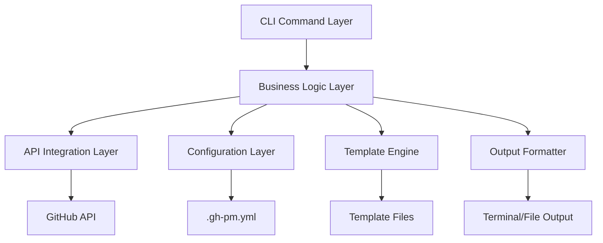
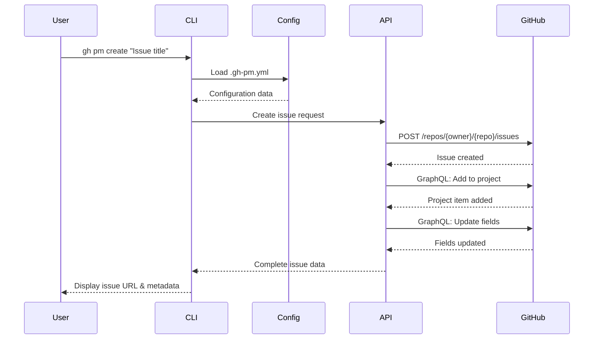
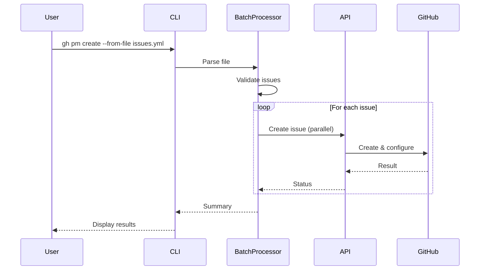
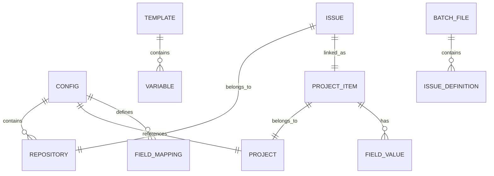
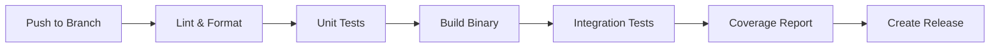

# 技術設計書

## 概要

本設計書は、`.gh-pm.yml` 設定ファイルに基づいて GitHub プロジェクトに Issue を作成する `gh pm create` コマンドの実装アプローチを定義します。このコマンドは、既存の Go ベースの gh-pm アーキテクチャに統合され、GitHub Projects v2 API を活用して Issue の作成とプロジェクトメタデータの管理を行います。

## 要件マッピング

### 設計コンポーネントのトレーサビリティ

各設計コンポーネントが対応する要件：

- **ConfigLoader** → 要件 1: 設定ファイルの読み込みと検証
- **IssueCreator** → 要件 2: Issue の作成と初期設定
- **ProjectMetadataManager** → 要件 3: プロジェクトメタデータの適用
- **BatchProcessor** → 要件 4: バッチ処理機能
- **TemplateEngine** → 要件 5: テンプレート機能
- **OutputFormatter** → 要件 6: 出力フォーマットとフィードバック
- **ErrorHandler** → 要件 7: 権限とエラーハンドリング

### ユーザーストーリーカバレッジ

- **設定の自動読み込み**: ConfigLoader が `.gh-pm.yml` を検索・検証
- **CLI からの Issue 作成**: IssueCreator が GitHub API を通じて Issue を作成
- **メタデータの自動設定**: ProjectMetadataManager が優先度・ステータスを適用
- **複数 Issue の一括作成**: BatchProcessor が並列処理で効率化
- **テンプレートからの生成**: TemplateEngine が変数展開と対話的入力を処理
- **多様な出力形式**: OutputFormatter が JSON/CSV/テーブル形式をサポート
- **包括的なエラー処理**: ErrorHandler が権限・ネットワーク・API エラーを処理

## アーキテクチャ

### システムアーキテクチャ



### 技術スタック

リサーチに基づく技術選択：

- **言語**: Go 1.23.0 (既存コードベースとの一貫性)
- **CLI フレームワーク**: Cobra v1.9.1 (既存の cmd パッケージパターンを踏襲)
- **GitHub 統合**: cli/go-gh/v2 v2.12.1 (GitHub CLI 公式ライブラリ)
- **設定管理**: gopkg.in/yaml.v3 (既存の config パッケージを拡張)
- **テスト**: stretchr/testify v1.7.0 (既存のテストパターンを維持)
- **並列処理**: Go の goroutine と channel を活用

### アーキテクチャ決定の根拠

- **Go 言語の選択**: 既存コードベースとの統合性、高速な実行、優れた並列処理
- **Cobra フレームワーク**: GitHub CLI エコシステムの標準、豊富な機能
- **GraphQL API 優先**: Projects v2 の全機能にアクセス可能、効率的なデータ取得
- **メタデータキャッシング**: API 呼び出しの削減、パフォーマンス向上

## データフロー

### プライマリユーザーフロー

#### 1. 単一 Issue 作成フロー



#### 2. バッチ処理フロー



## コンポーネントと インターフェース

### バックエンドサービスとメソッドシグネチャ

#### cmd/create.go
```go
type CreateCommand struct {
    config     *config.Config
    client     *project.Client
    issueAPI   *issue.Client
    formatter  *output.Formatter
}

func NewCreateCommand() *cobra.Command
func (c *CreateCommand) Execute(args []string) error
func (c *CreateCommand) validateFlags() error
```

#### pkg/issue/creator.go
```go
type Creator struct {
    client *api.RESTClient
    gql    *api.GraphQLClient
}

func (c *Creator) CreateIssue(data IssueData) (*Issue, error)     // Issue を作成
func (c *Creator) AddToProject(issueID, projectID string) error   // プロジェクトに追加
func (c *Creator) UpdateFields(itemID string, fields map[string]interface{}) error // フィールド更新
```

#### pkg/issue/batch.go
```go
type BatchProcessor struct {
    creator    *Creator
    maxWorkers int
}

func (b *BatchProcessor) ProcessFile(path string) (*BatchResult, error)  // ファイルから一括処理
func (b *BatchProcessor) ProcessIssues(issues []IssueData) (*BatchResult, error) // 複数 Issue を並列処理
```

#### pkg/template/engine.go
```go
type Engine struct {
    templates map[string]*Template
    prompter  *Prompter
}

func (e *Engine) LoadTemplate(name string) (*Template, error)      // テンプレート読み込み
func (e *Engine) Execute(template *Template, vars map[string]string) (*IssueData, error) // 変数展開
func (e *Engine) CollectVariables(template *Template) (map[string]string, error) // 対話的入力
```

#### pkg/output/formatter.go
```go
type Formatter struct {
    format OutputFormat
    writer io.Writer
}

func (f *Formatter) FormatIssue(issue *Issue) error               // 単一 Issue 出力
func (f *Formatter) FormatBatchResult(result *BatchResult) error  // バッチ結果出力
func (f *Formatter) FormatError(err error) error                  // エラー出力
```

### CLI フラグとオプション

| フラグ | 説明 | デフォルト値 |
|-------|------|------------|
| `--title, -t` | Issue タイトル | (必須) |
| `--body, -b` | Issue 本文 | "" |
| `--labels, -l` | ラベル (カンマ区切り) | config.defaults.labels |
| `--priority` | 優先度 | config.defaults.priority |
| `--status` | ステータス | config.defaults.status |
| `--repo, -r` | リポジトリ | config.repositories[0] |
| `--from-file` | バッチ処理用ファイル | - |
| `--template` | テンプレート名 | - |
| `--interactive, -i` | 対話モード | false |
| `--output, -o` | 出力形式 (table/json/csv) | table |
| `--quiet, -q` | 最小限の出力 | false |

## データモデル

### ドメインエンティティ



### データモデル定義

```go
// pkg/issue/models.go
type IssueData struct {
    Title       string              `yaml:"title" json:"title"`
    Body        string              `yaml:"body" json:"body"`
    Labels      []string            `yaml:"labels" json:"labels"`
    Repository  string              `yaml:"repository" json:"repository"`
    Priority    string              `yaml:"priority" json:"priority"`
    Status      string              `yaml:"status" json:"status"`
    CustomFields map[string]string  `yaml:"custom_fields" json:"custom_fields"`
}

type Issue struct {
    ID          string    `json:"id"`
    Number      int       `json:"number"`
    Title       string    `json:"title"`
    URL         string    `json:"url"`
    State       string    `json:"state"`
    Repository  string    `json:"repository"`
    ProjectItem *ProjectItem `json:"project_item,omitempty"`
    CreatedAt   time.Time `json:"created_at"`
    UpdatedAt   time.Time `json:"updated_at"`
}

type ProjectItem struct {
    ID        string                 `json:"id"`
    ProjectID string                 `json:"project_id"`
    Fields    map[string]interface{} `json:"fields"`
}

// pkg/template/models.go
type Template struct {
    Name        string              `yaml:"name"`
    Description string              `yaml:"description"`
    Variables   []Variable          `yaml:"variables"`
    Issue       IssueData           `yaml:"issue"`
}

type Variable struct {
    Name        string   `yaml:"name"`
    Description string   `yaml:"description"`
    Type        string   `yaml:"type"`
    Required    bool     `yaml:"required"`
    Default     string   `yaml:"default"`
    Options     []string `yaml:"options,omitempty"`
}

// pkg/issue/batch_models.go
type BatchFile struct {
    Version string      `yaml:"version"`
    Issues  []IssueData `yaml:"issues"`
}

type BatchResult struct {
    Total      int           `json:"total"`
    Succeeded  int           `json:"succeeded"`
    Failed     int           `json:"failed"`
    Issues     []*Issue      `json:"issues"`
    Errors     []BatchError  `json:"errors,omitempty"`
}

type BatchError struct {
    Index   int    `json:"index"`
    Title   string `json:"title"`
    Error   string `json:"error"`
}
```

## エラーハンドリング

### エラー階層

```go
// pkg/issue/errors.go
type ErrorType int

const (
    ErrorTypeValidation ErrorType = iota
    ErrorTypeConfiguration
    ErrorTypePermission
    ErrorTypeNetwork
    ErrorTypeRateLimit
    ErrorTypeNotFound
    ErrorTypeAPI
)

type IssueError struct {
    Type    ErrorType
    Message string
    Cause   error
    Suggestion string
}

func (e *IssueError) Error() string
func (e *IssueError) Unwrap() error
```

### エラー処理戦略

1. **検証エラー**: 即座に処理を中止し、修正方法を提示
2. **設定エラー**: `gh pm init` コマンドの実行を提案
3. **権限エラー**: 必要な権限とトークンスコープを表示
4. **ネットワークエラー**: 自動リトライ（最大3回）
5. **レート制限**: リセット時刻を表示し、待機オプションを提供
6. **API エラー**: 詳細なエラーメッセージとGitHub ステータスページへのリンク

## セキュリティ考慮事項

### 認証と認可

- GitHub CLI の既存認証機構（`gh auth`）を利用
- トークンスコープの検証（repo, project, write:org）
- 環境変数 `GH_TOKEN` のサポート

### データ保護

- センシティブ情報（トークン）のログ出力禁止
- 設定ファイルの権限チェック（644以下）
- テンプレート変数のサニタイゼーション

### セキュリティベストプラクティス

- 入力検証（タイトル長、ラベル形式）
- GraphQL クエリのパラメータ化
- API レート制限の遵守
- HTTPS 通信の強制

## パフォーマンスとスケーラビリティ

### パフォーマンス目標

| メトリクス | 目標値 | 測定対象 |
|-----------|--------|----------|
| 単一 Issue 作成時間 | < 2秒 | E2E 実行時間 |
| バッチ処理（100 Issues） | < 30秒 | 並列処理時間 |
| メモリ使用量 | < 50MB | 通常操作時 |
| 設定読み込み時間 | < 100ms | ファイル解析 |

### キャッシング戦略

- **プロジェクトメタデータ**: `.gh-pm.yml` に埋め込みキャッシュ
- **フィールド ID マッピング**: 初回取得後にキャッシュ
- **API レスポンス**: 15分間の TTL でメモリキャッシュ

### スケーラビリティアプローチ

- **並列処理**: goroutine プールによるバッチ処理（デフォルト: 5並列）
- **ストリーミング**: 大規模バッチファイルの逐次処理
- **レート制限対応**: 自動スロットリングと待機

## テスト戦略

### テストカバレッジ要件

- **ユニットテスト**: ≥80% コードカバレッジ
- **統合テスト**: 全 API エンドポイントとの連携
- **E2E テスト**: 主要ユーザーフロー
- **パフォーマンステスト**: 期待ピークの 2倍負荷

### テストアプローチ

#### 1. ユニットテスト
```go
// cmd/create_test.go
func TestCreateCommand_Execute(t *testing.T)
func TestCreateCommand_ValidateFlags(t *testing.T)

// pkg/issue/creator_test.go
func TestCreator_CreateIssue(t *testing.T)
func TestCreator_AddToProject(t *testing.T)
```

#### 2. 統合テスト
```go
// test/integration/create_test.go
func TestCreateIssueWithProject(t *testing.T)
func TestBatchCreateFromFile(t *testing.T)
func TestTemplateExecution(t *testing.T)
```

#### 3. モックとテストデータ
```go
// pkg/issue/mocks/client_mock.go
type MockClient struct {
    mock.Mock
}

// test/fixtures/
// - valid_batch.yml
// - invalid_batch.yml
// - template_basic.yml
```

### CI/CD パイプライン



## 実装フェーズ

### フェーズ 1: 基本機能（優先度: 高）
- ConfigLoader の実装
- 基本的な Issue 作成機能
- プロジェクトへの追加機能

### フェーズ 2: メタデータ管理（優先度: 高）
- フィールド更新機能
- 優先度・ステータス設定
- ラベル適用

### フェーズ 3: 高度な機能（優先度: 中）
- バッチ処理
- テンプレートエンジン
- 対話モード

### フェーズ 4: 最適化（優先度: 低）
- パフォーマンス改善
- キャッシング実装
- エラーリカバリー強化