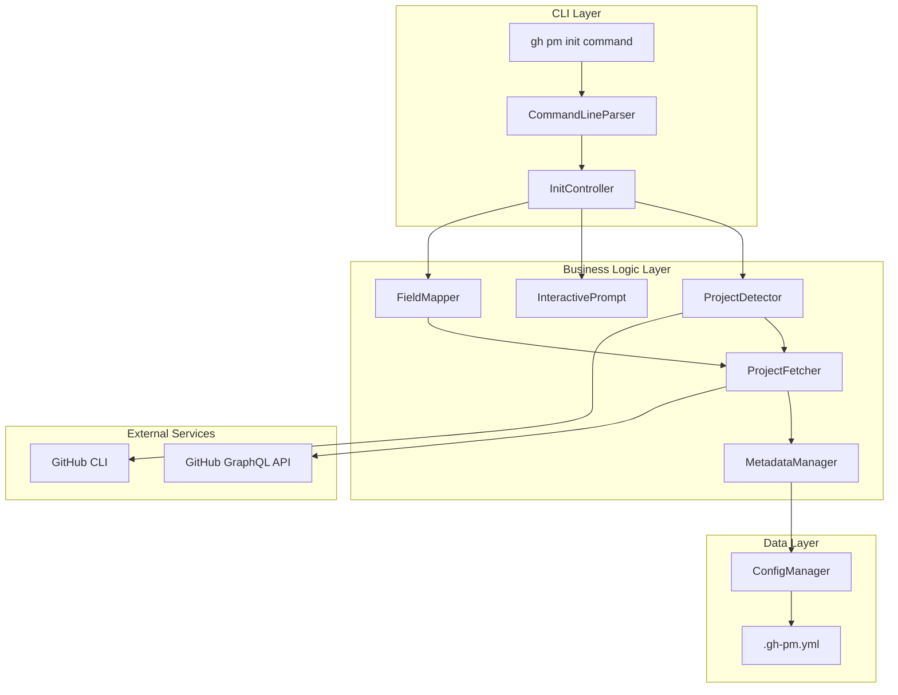
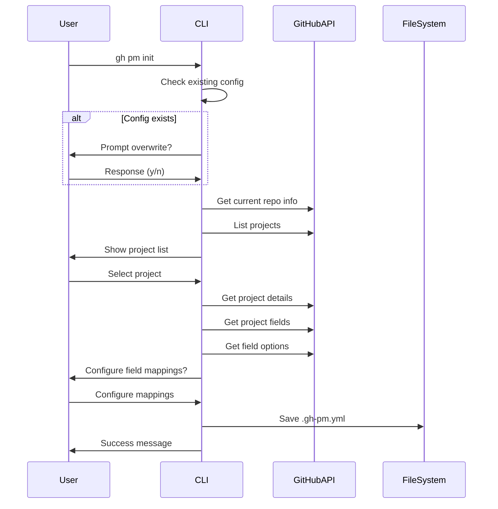
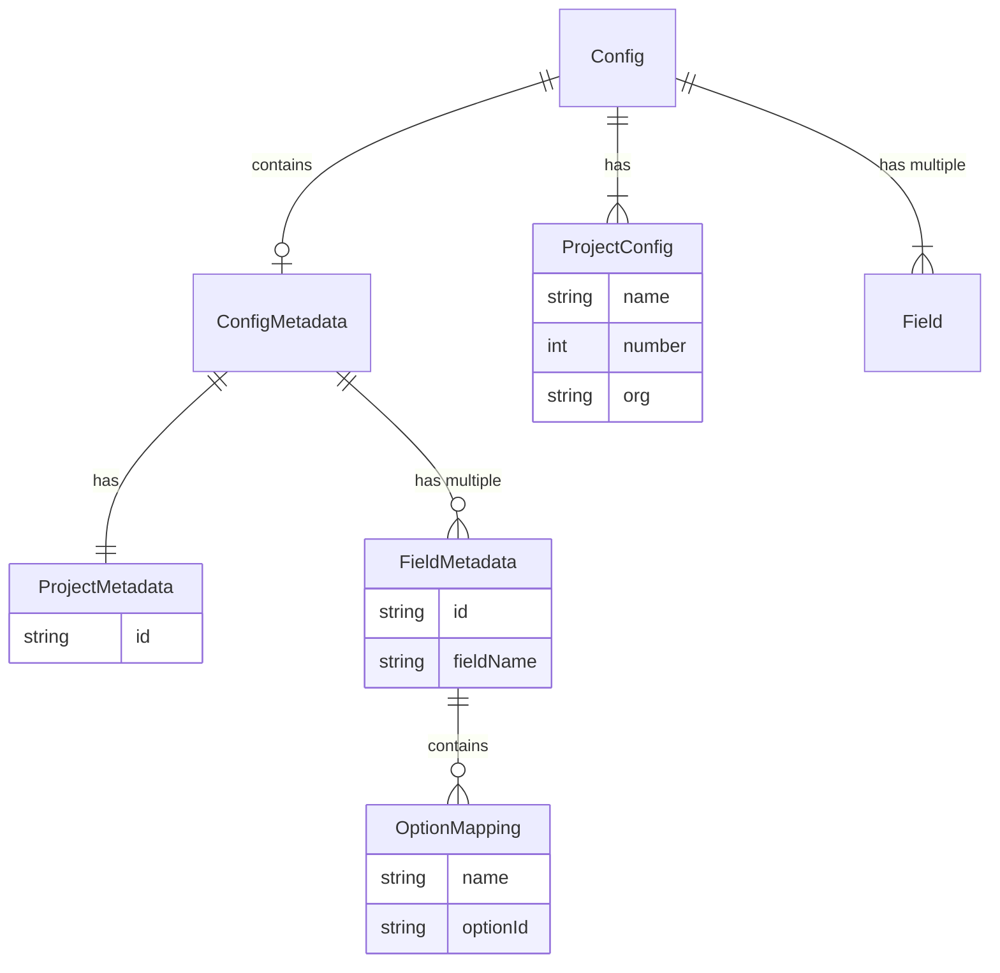
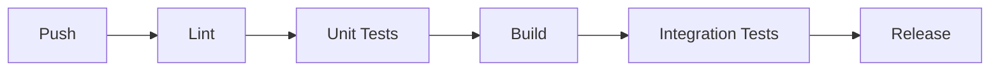

# 技術設計書

## 概要

`gh pm init` コマンドは、GitHub Projects v2 と連携したプロジェクト管理システムの初期設定を行うコマンドです。本設計では、要件定義書で定義された8つの要件を満たすために、既存のGoコードベースを拡張し、プロジェクトメタデータの取得・保存機能を追加します。

## 要件マッピング

### 設計コンポーネントのトレーサビリティ

各設計コンポーネントが対応する要件：

- **ConfigManager** → 要件1: 設定ファイルの初期化
- **ProjectDetector** → 要件2: プロジェクトの自動検出と選択
- **CommandLineParser** → 要件3: コマンドラインフラグによる設定
- **InteractivePrompt** → 要件4: 対話的モードでの設定入力
- **FieldMapper** → 要件5: カスタムフィールドマッピングの設定
- **ProjectFetcher** → 要件6: プロジェクト詳細の自動取得
- **DefaultValueProvider** → 要件7: 設定ファイルのデフォルト値
- **MetadataManager** → 要件8: プロジェクトメタデータの保存

### ユーザーストーリーカバレッジ

- プロジェクト管理者向け: ConfigManager、DefaultValueProvider、MetadataManager が設定ファイルの初期化と管理を提供
- 開発者向け: ProjectDetector、ProjectFetcher が自動検出機能を実装
- DevOpsエンジニア向け: CommandLineParser が非対話的な自動化を実現
- 新規ユーザー向け: InteractivePrompt、DefaultValueProvider がガイド付き設定を提供
- パワーユーザー向け: MetadataManager がメタデータキャッシュ機能を実装

## アーキテクチャ

### システム構成図



### 技術スタック

- **言語**: Go 1.19+
- **CLIフレームワーク**: Cobra (spf13/cobra)
- **GitHub API クライアント**: cli/go-gh/v2
- **設定ファイル形式**: YAML (gopkg.in/yaml.v3)
- **テストフレームワーク**: Go標準testing パッケージ
- **モックライブラリ**: testify/mock

### アーキテクチャ決定根拠

- **Go言語**: GitHub CLIエクステンションとの互換性、高速な起動時間
- **Cobra**: GitHub CLIで採用されているCLIフレームワーク、豊富な機能
- **cli/go-gh**: GitHub公式のGoクライアント、認証の自動処理
- **YAML**: 人間が読み書きしやすい設定ファイル形式

## データフロー

### 初期化処理の主要フロー



## コンポーネントと インターフェース

### バックエンドサービスとメソッドシグネチャ

#### ConfigManager (pkg/config/config.go 拡張)

```go
type ConfigMetadata struct {
    Project ProjectMetadata `yaml:"project"`
    Fields  FieldsMetadata  `yaml:"fields"`
}

type ProjectMetadata struct {
    ID string `yaml:"id"` // Node ID (e.g., "PVT_kwHOAAlRwM4A8arc")
}

type FieldsMetadata struct {
    Status   FieldMetadata `yaml:"status,omitempty"`
    Priority FieldMetadata `yaml:"priority,omitempty"`
}

type FieldMetadata struct {
    ID      string            `yaml:"id"`      // Field ID
    Options map[string]string `yaml:"options"` // name -> option ID
}

type Config struct {
    // 既存フィールド
    Project      ProjectConfig      `yaml:"project"`
    Repositories []string           `yaml:"repositories"`
    Defaults     DefaultsConfig     `yaml:"defaults"`
    Fields       map[string]Field   `yaml:"fields"`
    Output       OutputConfig       `yaml:"output"`
    // 新規フィールド
    Metadata     *ConfigMetadata    `yaml:"metadata,omitempty"`
}

func (c *Config) SaveWithMetadata(path string) error // メタデータ付き保存
func (c *Config) LoadMetadata() (*ConfigMetadata, error) // メタデータ読み込み
```

#### ProjectDetector (pkg/init/detector.go - 新規)

```go
type ProjectDetector struct {
    client *project.Client
}

func NewProjectDetector() (*ProjectDetector, error) // コンストラクタ
func (d *ProjectDetector) DetectCurrentRepo() (org, repo string, err error) // リポジトリ検出
func (d *ProjectDetector) ListRepoProjects(org, repo string) ([]Project, error) // リポジトリプロジェクト一覧
func (d *ProjectDetector) ListOrgProjects(org string) ([]Project, error) // 組織プロジェクト一覧
```

#### MetadataManager (pkg/init/metadata.go - 新規)

```go
type MetadataManager struct {
    client *project.Client
}

func NewMetadataManager(client *project.Client) *MetadataManager // コンストラクタ
func (m *MetadataManager) FetchProjectMetadata(projectID string) (*ProjectMetadata, error) // プロジェクトメタデータ取得
func (m *MetadataManager) FetchFieldMetadata(projectID string, fieldName string) (*FieldMetadata, error) // フィールドメタデータ取得
func (m *MetadataManager) BuildMetadata(project *Project, fields []Field) (*ConfigMetadata, error) // 完全なメタデータ構築
```

#### InteractivePrompt (pkg/init/prompt.go - 新規)

```go
type InteractivePrompt struct {
    scanner *bufio.Scanner
}

func NewInteractivePrompt() *InteractivePrompt // コンストラクタ
func (p *InteractivePrompt) ConfirmOverwrite() bool // 上書き確認
func (p *InteractivePrompt) SelectProject(projects []Project) *Project // プロジェクト選択
func (p *InteractivePrompt) ConfigureFieldMapping(field Field) map[string]string // フィールドマッピング設定
func (p *InteractivePrompt) GetStringInput(prompt string, defaultValue string) string // 文字列入力
```

### コマンドラインフラグ

| フラグ | 型 | デフォルト | 説明 |
|--------|------|------------|------|
| --project | string | "" | プロジェクト名またはID |
| --org | string | "" | 組織名 |
| --repo | []string | [] | リポジトリリスト (owner/repo形式) |
| --interactive | bool | true | 対話的モード |
| --list | bool | false | 全プロジェクト一覧表示 |
| --skip-metadata | bool | false | メタデータ取得をスキップ |

## データモデル

### ドメインエンティティ



### 設定ファイル構造 (.gh-pm.yml)

```yaml
# プロジェクト設定
project:
  name: "My Project"
  number: 1
  org: "my-organization"

# リポジトリ設定
repositories:
  - owner/repo1
  - owner/repo2

# デフォルト値
defaults:
  priority: medium
  status: "Todo"
  labels:
    - "pm-tracked"

# フィールドマッピング
fields:
  priority:
    field: "Priority"
    values:
      low: "Low"
      medium: "Medium"
      high: "High"
      critical: "Critical"
  status:
    field: "Status"
    values:
      todo: "Todo"
      in_progress: "In Progress"
      in_review: "In Review"
      done: "Done"

# メタデータ (新規追加)
metadata:
  project:
    id: "PVT_kwHOAAlRwM4A8arc"
  fields:
    status:
      id: "PVTSSF_lAHOAAlRwM4A8arczgwbDH4"
      options:
        todo: "f75ad846"
        in_progress: "47fc9ee4"
        in_review: "c3d4e5f6"
        done: "98236657"
    priority:
      id: "PVTSSF_lAHOAAlRwM4A8arczgwbDH8"
      options:
        low: "abc12345"
        medium: "def67890"
        high: "ghi13579"
        critical: "jkl24680"

# 出力設定
output:
  format: table
  color: true
  timezone: "UTC"
```

## エラーハンドリング

### エラー階層

```go
// エラータイプ定義
type InitError struct {
    Type    ErrorType
    Message string
    Cause   error
}

type ErrorType int

const (
    ErrorTypeConfig ErrorType = iota
    ErrorTypeGitHub
    ErrorTypeFileSystem
    ErrorTypeValidation
)

// エラーハンドリング戦略
func handleInitError(err error) {
    switch e := err.(type) {
    case *InitError:
        switch e.Type {
        case ErrorTypeConfig:
            // 設定ファイルエラー: 詳細なガイダンスを表示
        case ErrorTypeGitHub:
            // GitHub APIエラー: ネットワーク/認証の確認を促す
        case ErrorTypeFileSystem:
            // ファイルシステムエラー: 権限確認を促す
        case ErrorTypeValidation:
            // 検証エラー: 入力値の修正を促す
        }
    default:
        // 未知のエラー: スタックトレースとサポート情報を表示
    }
}
```

## セキュリティ考慮事項

### 認証と認可

- GitHub CLIの認証機構を利用（`gh auth status`）
- トークンは直接扱わず、cli/go-ghライブラリに委譲
- プロジェクトアクセス権限の事前確認

### データ保護

- 設定ファイルには機密情報を保存しない
- メタデータIDは公開情報として扱う
- ファイル権限は0644（読み取り可能、書き込みは所有者のみ）

### 入力検証

- プロジェクト番号: 正の整数
- 組織名/リポジトリ名: GitHub命名規則に準拠
- フラグ値: 定義された選択肢のみ受け付け

## パフォーマンスと拡張性

### パフォーマンス目標

| メトリクス | 目標値 | 測定対象 |
|------------|--------|----------|
| 初期化時間 | < 5秒 | 対話的モードでの全体処理 |
| API呼び出し | < 10回 | 1回の初期化での最大API呼び出し数 |
| メモリ使用量 | < 50MB | ピーク時のメモリ使用量 |

### 最適化戦略

- GraphQL APIのバッチクエリ活用
- 必要なフィールドのみ取得
- メタデータの条件付き取得（--skip-metadataフラグ）

## テスト戦略

### テストカバレッジ要件

- ユニットテスト: ≥80% のコードカバレッジ
- 統合テスト: 主要なユーザーフロー
- E2Eテスト: 実際のGitHub APIとの連携（CI環境）

### テストアプローチ

#### ユニットテスト

```go
func TestConfigManager_SaveWithMetadata(t *testing.T) {
    // メタデータ付き設定ファイルの保存テスト
}

func TestProjectDetector_DetectCurrentRepo(t *testing.T) {
    // リポジトリ検出ロジックのテスト
}

func TestMetadataManager_BuildMetadata(t *testing.T) {
    // メタデータ構築ロジックのテスト
}
```

#### 統合テスト

```go
func TestInitCommand_InteractiveFlow(t *testing.T) {
    // 対話的フローの統合テスト（モックAPI使用）
}

func TestInitCommand_NonInteractiveFlow(t *testing.T) {
    // 非対話的フローの統合テスト（フラグ指定）
}
```

### CI/CDパイプライン



## 実装上の考慮事項

### 後方互換性

- 既存の設定ファイルは引き続き動作
- metadataセクションはオプショナル
- 段階的な機能追加が可能

### エラーリカバリー

- メタデータ取得失敗時も基本設定は作成
- 部分的な成功を許容（一部フィールドのみメタデータ取得）
- 再実行可能な設計

### 拡張ポイント

- カスタムフィールドタイプの追加
- 新しいメタデータタイプのサポート
- プロバイダーパターンによる異なるプロジェクト管理システムへの対応